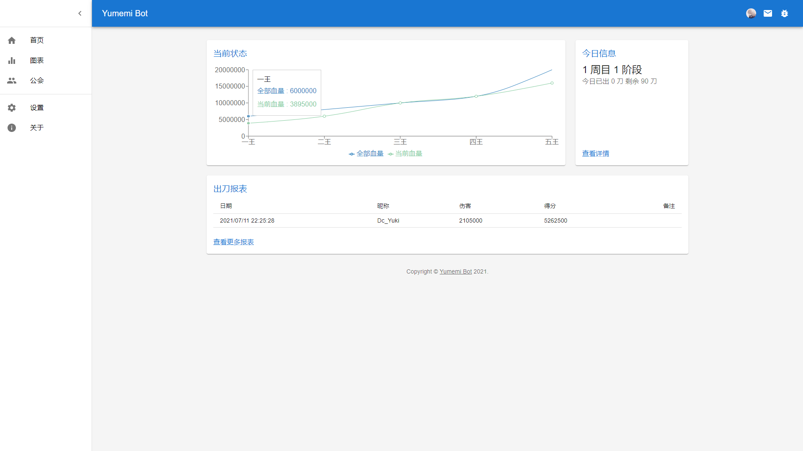

### 更新日志 <!-- {docsify-ignore} -->

#### 下一个版本计划
  - 停止更新公告
    + 项目整体重构中，预计花费时间较长，在此期间不会 添加 | 维护 任何 新功能 | bug
    + 开发画面仅供参考，还请以实际效果为主

  

> とある咕咕の更新日志

#### 0.5.1 (2021.03.03)
  - add plugin
    + 新增 bilibili 动态监听
    + 新增五子棋小游戏
  - refactor code
    + 添加国服公会排名查询
  - fix bug
    + 代码性能优化 & 数据修正
    + 修复加入新群聊 pluginSettings 丢失的问题

#### 0.5.0 (2021.02.08)
  - add plugin
    + 新增每日一言 ~~生不出人我很抱歉~~
  - refactor code
    + 重构项目逻辑
    + 优化大量代码及原插件兼容
    + 新增 groups 群聊信息自动添加
    + 新增 bot 自动同意加群及好友申请
    + 优化 command.yml 结构
    + 封装 http、schedule 至 tools.js
    + 移除 plugin 必须传入 settings 对象的约束
    + 重构色图
      - 本地存储图片，优化发送速度
      - 多 api 支持（acgmx、lolicon）
      - 增加每日色图获取上限及小黑屋功能
  - fix bug
    + 修复 lolicon api 301 跳转的错误
    + 优化 buy 多余的 for 循环操作
    + 移除 mirai-ts 时期的废弃代码
    + 修复 plugin 目录下不存在 index.js 抛出异常的问题

 

#### 0.4.4 (2021.01.22)
  - refactor code
    + 优化数据库结构
    + 优化 sql 函数，简化大量重复调用
#### 0.4.3 (2021.01.18)
  - add plugin
    + 新增 GitHub webhook 推送
#### 0.4.2 (2021.01.16)
  - add plugin
    + 新增 web 后台青春版
  - fix bug
    + 修复了 reservations.yml 生成异常的错误
  
#### 0.4.1 (2021.01.09)
  - repository public
    + 项目仓库开源
  - refactor code
    + 添加 SQLite 初步完成会战重构 ~~MongoDB：所以爱是会消失的对么？~~
  - fix bug
    + 修复会战因异步导致数值异常的问题

#### 0.4.0 (2021.01.01)
  - refactor code
    + 项目结构大大大改 ~~别改了别改了~~
    + 新增 yml 配置文件自动生成与校验
    + 优化 qq 登录校验，设备锁、验证码监听
    + 优化代码逻辑，自动加载模块无需手动引入

 

#### 0.3.6 (2020.12.15)
  - refactor code
    + 优化权限管理逻辑

#### 0.3.5 (2020.11.26)
  - add plugin
    +  新增模块参数修改
  - refactor code
    + 简化项目结构，移除废弃代码

#### 0.3.4 (2020.11.11)
  - refactor code
    + 优化代码逻辑
    + 支持参数热更新（修改参数后无需重启 bot）

#### 0.3.3 (2020.10.31)
  - add plugin
    + 新增群管提示（欢迎新人、关小黑屋、塞口球...等）
  - fix bug
    + 修复 schedule 鬼畜触发的 bug

#### 0.3.2 (2020.10.30)
  - add plugin
    + 新增多群权限管理
    + 新增 rank 一图流查询
    + 新增群内头衔申请
    + 扭蛋支持卡池切换
    + 买药小助手支持图片发送

#### 0.3.1 (2020.10.21)
  + fix bug
    - 修复了 lolicon 请求 301 跳转的报错

#### 0.3.0 (2020.10.19)
  - change frame
    + 框架由 mirai-ts 移植至 oicq ~~你他喵的有完没完啊 kora~~

 

#### 0.2.4 (2020.10.02)
  - refactor code
    + 重构扭蛋，支持图片发送，新增日、台服卡池

#### 0.2.3 (2020.09.29)
  - refactor code
    + 重构色图，默认闪图发送，添加 tag 搜索 ~~求生欲极强~~

#### 0.2.2 (2020.09.21)
  - update plugin
    + 重构买药助手，暂不支持图片发送

#### 0.2.1 (2020.09.15)
  - refactor code
    + 重构会战报刀，新增预约功能

#### 0.2.0 (2020.08.29)
  - refactor code
    + 新增 YAML 配置文件
    + 项目结构大改，优化代码逻辑
    + 将仓库由 Github 迁移至 Gitee 以便提升国内访问速度 ~~广电是我永远的噩梦~~

 

#### 0.1.3 (2020.08.28)
  - add plugin
    + 新增会战报刀，目前数据存储在 JSON 中，日后会逐渐完善 ~~能用 JSON 干嘛要用 BD~~

#### 0.1.2 (2020.08.24)
  - refactor code
    + 重构色图，暂不支持图片发送

#### 0.1.1 (2020.08.18)
  - refactor code
    + 重构扭蛋，暂不支持图片发送

#### 0.1.0 (2020.08.14)
  - change frame
    + ~~框架都换了跨个版本号不过分吧~~
    + koishi v2 的 doc 老咕咕咕了，更新后 config 结构都变了，项目都跑不起来，坑太多了 ~~我太菜了，面向源码编程~~ ，移植至 mirai-ts

 

#### 0.0.5 (2020.08.13)
  - add plugin
    + 新增扭蛋十连，目前只有文字模式

#### 0.0.4 (2020.08.10)
  - remove code
    + 优化代码逻辑
    + 因 pcrdfans key 被回收，移除写到一半的 jjc 代码

#### 0.0.3 (2020.07.29)
  - add plugin
    + 新增买药助手，暂不支持图片发送

#### 0.0.2 (2020.07.28)
  - add plugin
    + 新增色图，目前只能发链接，暂不支持图片发送 ~~ghs 才是第一生产力~~

#### 0.0.1 (2020.07.26)
  - create repository
    + 原项目名为 kokkoro ，基于 nonebot ，现从零开始移植至 koishi ~~js是世界上最好的语言~~