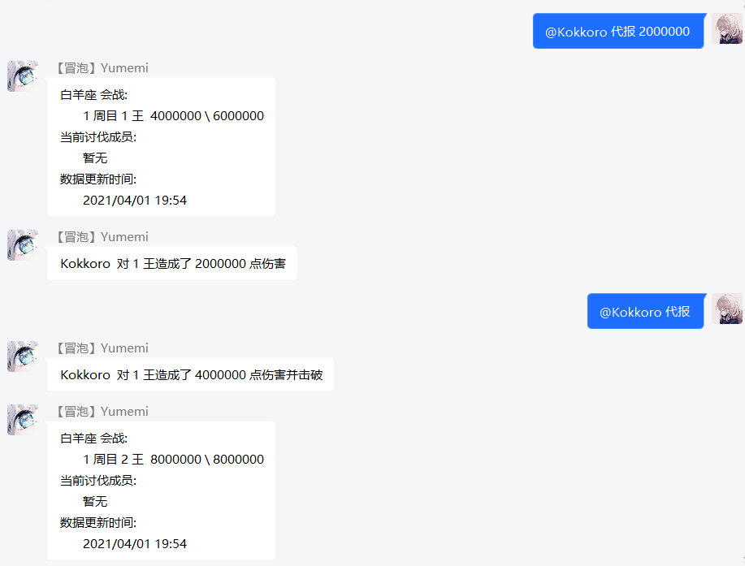
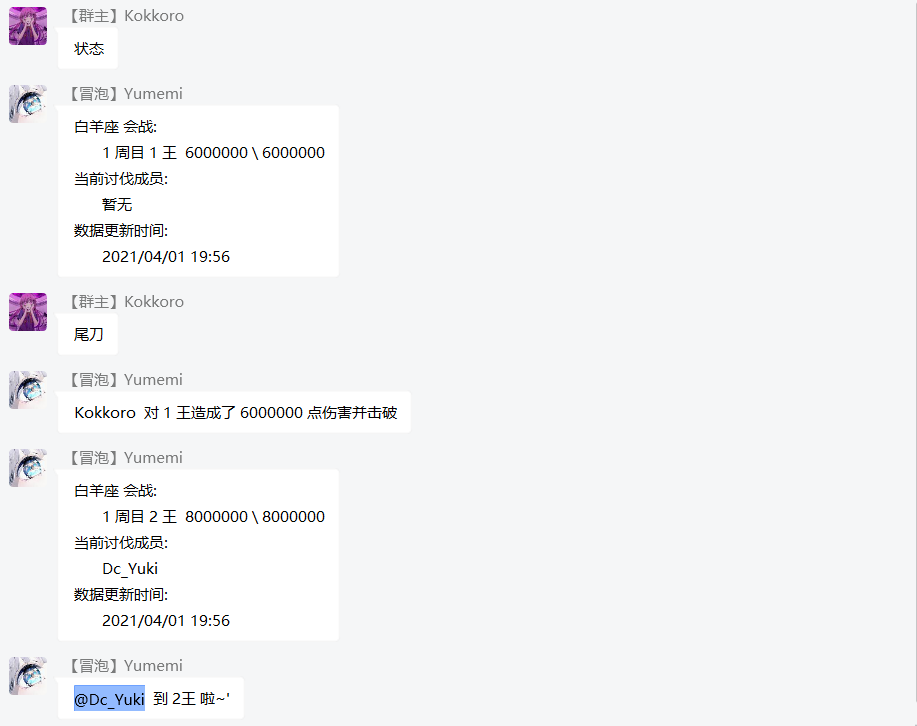

### 模块列表 <!-- {docsify-ignore} -->

>`yumemi`主要以 [公主连结☆Re:Dive](https://priconne-redive.jp/) 玩家为核心，预计开发模块有：

- ~**摸轴录入**~ (BigFun官方工具上线，移除)
- ~**击剑作业**~ (作业网 aip key 已被回收，暂不可用)
- ~**web 后台**~ ~(BigFun官方工具上线，移除)~ (因群友要求，项目基于 react 重构中...)
- **会战管理**
- **买药助手**
- **rank 搬运**
- **图片搜索**
- **每日一言**
- **动态监听**
- **排名查询**

### 娱乐功能 <!-- {docsify-ignore} -->

- **你问我答**
- **五 子 棋**
- **群 空 调**
- **头像竞猜**
- ~**图灵聊天**~(人工智障，已移除)
- ~**趣味十连**~(数据库重构中，暂时移除)
- **随机涩图**
- **头衔申请**

### 其它功能 <!-- {docsify-ignore} -->

- ~**新番推送**~
- **图片查询**

!> 由于`yumemi`更新进度缓慢，某些功能未能在上面列出，但会在日后补上，下面具体介绍

> 由于当前页面内容较多，还请善用侧边栏的搜索功能

### 你问我答

- 举个栗子
  + 输入`有人问 xxx 你答 xxx`可自定义群内词库
  + 输入`看看有人问`可以查看当前已定义的正则
- 正则公式
  + `^有人(问|说)\S+你就?(回|答|说|告诉他|告诉她)\S+$`
  + `^看看有人问$`
- 补充说明
  + 推荐使用正则，若发送的文本不包含`^`或`$`其中一个，将会在消息首尾自动添加

### 五 子 棋

- 举个栗子
  + 输入`五子棋`可开启游戏，输入 `落子 <param>` 来执行对应操作
  + 输入`中止对局`以结束当前对局
- 正则公式
  + `^五子棋[\s]?[0-9]*$`
  + `^落子[\s]?[a-zA-Z][1-9]+[0-9]?$`
  + `^悔棋$`
  + `^中止对局$`
- 补充说明
  + 为了节省流量 ~~工作量~~ ，五子棋发送内容为字符串，pc 端会出现排版错位，移动端可正常使用

### 群 空 调

- 举个栗子
  + 输入`开空调`可打开群空调，输入 `设置温度 <param>` 来调节温度
  + 输入`当前温度`来查看温度
- 正则公式
  + `^(开|打开|启动)空调$`
  + `^(关|关上|关闭)空调$`
  + `^设置温度\s?-?[1-9]\d*$`
  + `^(群|当前|查看)温度$`
- 补充说明
  + ~~年轻人的第一款人造太阳~~
  + 简单高效，节能环保，就是没风

### 趣味十连

- 举个栗子
  + 扭蛋池抽取分为普通池和付费池，`来发十连`、`抽个十连`等均可触发，默认抽取白金卡池
- 正则公式
  + `^[来抽][发个次]十连$`
  + `^[来抽][发个次](付费十连|傻子必得|傻必)$`
  + `^(查看|当前|当期|本期)(卡池|up|扭蛋|扭蛋池)$`
- 补充说明
  + 输入`来发傻必`抽取付费十连，计划日后添加每日签到功能赠送付费石，可随意分配抽取
  + 支持卡池切换，输入`切换卡池 <param>`可自由切换`bl`、`tw`、`jp`卡池
- 问答环节
  + 为什么没有做抽一井的功能？
  + 个人认为做出来会大大减少抽卡的趣味性，模拟抽卡本身就是为了趣味性和爽，你看那傻子必得他不香么（  

### 随机涩图

- 举个栗子
  + 涩图分为随机涩图与指定涩图，`来份色图`、`来张涩图`等均可触发
- 正则公式
  + `^来[点张份][涩瑟色]图$`
  + `^来[点张份][\S]+[涩瑟色]图$`
- 补充说明
  + 图片来源p站，支持 tag 搜索，例如`来点可可萝色图` ~~（我报警了）~~ ，`来点`与`色图`之间为关键字
  + 本功能的初衷是为了活跃群内氛围以及增加趣味性而制作，请某些`lsp`和`未成年人`节制使用
  + 发送的图片请务必遵守所在国家及其地区的`法律法规`，因使用不当所造成的后果本人概不负责

### 头衔申请

- 举个栗子
  + 此功能触发比较简单，`申请头衔 <param>`即可触发，例如`申请头衔 咕咕咕` ~~（其它功能在做了在做了）~~
- 正则公式
  + `^申请头衔[\s]?.+$`
- 补充说明
  + 本功能需要bot有群主权限

### 买药助手

- 举个栗子
  + ~~哈？这么简单的功能直接看下源码不就知道怎么用了么，还需要说明？~~
- 补充说明
  + 在每天的`0`、`6`、`12`、`18`点整发送买药提示
  + 如要自定义可查看`plugins/buy/index.js`，稍作修改即可实现时钟功能
  + 若要修改为东九时区（日服）可使用指令`> update buy version jp`~~这个指令我没写语法糖~~

### 每日一言

- 举个栗子
  + 在每天的`0`点整发送随机一言，发送`来点骚话`也可以主动获取
- 正则公式
  + `^(来|说)(点|句|段)骚话$`
- 补充说明
  ~~生不出人我很抱歉~~

### rank 搬运

- 举个栗子
  + `台rank`、`国服rank`均可触发
- 正则公式
  + `^(b|bl|国|t|tw|台|省|j|jp|日)服?(r|R)ank$`
- 补充说明
  + 表格仅供参考，升r有风险，强化需谨慎
- 数据来源
  + 国服：[席巴鸽](https://space.bilibili.com/14454663)
  + 台服：[無羽nonplume](https://forum.gamer.com.tw/A.php?bsn=30861)
  + 日服：待补充

### 图片搜索
- 举个栗子
  + 发送`搜图`将会记录当前用户信息，该用户若后续单独发送 **一张** 图片，便可开始搜索
- 正则公式
  + `^(搜图|\[CQ:image,file=.+,url=.+\])$`
- 补充说明
  + 三次元图片搜索精度不高，本来是为了方便自己搜本子做出来的，不建议在群里搜一些奇怪的图片（

### 头像竞猜
- 举个栗子
  + 发送`猜头像`会随机发送一张角色裁剪过后的头像，可以和群成员一起竞猜
- 正则公式
  + `(^猜头像$|.*)`
- 补充说明
  + 这个功能群友老早就说想要一个了，咕好久了，实在是惭愧（

### 会战管理

!> 这里是正在施工的 **会战管理** 文档，不定时更新

#### 发起会战

- 在使用会战功能前，若你从未修改过公会信息，则需要先设置当前游戏服务器
- 举个栗子
  + `设置 <param> 公会`，默认参数为 `none` ，可选 `bl`、`tw`、`jp`，对应`国服`、`台服`、`日服`
- 正则公式
  + `^设置(国|台|日)服公会$`

- 在一切准备就绪后你就可以开启当期会战
- 举个栗子
  + 发送`开启 <param> 座会战`可初始化公会战数据，`<param>` 为当期会战星座
- 正则公式
  + `^开启\S\S座会战$`
- 补充说明
  + 发送指令后会自动记录当月时间，无需手动关闭，下期会战到来之际发起的会战请求即可 ~~不要问我名字打错了怎么改，我没做这功能~~

#### 中止会战

- 举个栗子
  + 若开启会战仅仅是为了测试，可以输入`中止会战`来关闭当月会战请求
- 正则公式
  + `^中止会战$`
- 补充说明
  + 请注意该操作不可逆，中止会战将 **清空** 当月所有数据

#### 伤害记录

- 举个栗子
  + 发送`报刀 <param>`即可记录出刀数据
  + 若斩杀 boss ，则需要输入`尾刀`指令而不是`报刀`，不必传递其它参数
- 正则公式
  + `(^[1-5]?\s?报刀\s?[1-9]\d*$|^[1-5]?\s?尾刀$)`
- 补充说明
  + 如果你是日服公会，在 **报刀** 前面输入 boss 编号可指定对应 boss ，例如`2 报刀 3000000`或`5 尾刀`
  + 若未指定 boss 编号则会默认指定当前第一个存活的 boss

#### 出刀代报
- 举个栗子
  + `@xxx 代报 100000`可以为群成员代报出刀，若斩杀 boss ，不输入伤害数值默认尾刀
- 正则公式
  + `^\[CQ:at,qq=\d+,text=@.*\]\s?[1-5]?\s?\u4EE3\u62A5\s?\d*$`
- 补充说明
  + 日服指定 boss 与报刀同理，在 **代报** 前面指定 boss 编号即可

#### 出刀修改
- 举个栗子
  + 发送`查刀`可查看你 **当天** 所有的出刀数据 ~~报个刀都会报错，真丢人，退群吧你~~
  + 格式为`1 修改 1200000`，`1`代表当天出的第一刀，`1200000`则是修正后的数据
- 正则公式
  + `^[0-3](\.5)?[\s]?修改[\s]?[1-9]\d*$`
- 补充说明
  + 修改出刀信息后会自动纠正 **当前周目** boss 的血量，无需手动矫正，若已跨周目不建议单独修改报刀数据

#### 预约提醒

- 举个栗子
  + 发送`预约`可查看当前预约信息
  + 若需要预约 boss ，输入`预约 <param>`将会在 boss 变更时收到 At 提示，参数为`1 ~ 5`
- 正则公式
  + `^预约[\s]?[1-5]?$`

!> 因兼容日服会战，数据库变动较大，以下功能暂时不可使用

#### 状态变更
- 举个栗子
  + `周目 1 boss 1 血量 6000000`可变更当前 boss 状态信息
- 正则公式
  + `^((\u5468\u76EE|boss|\u8840\u91CF)\s?[1-9]\d*\s?){1,3}$`
- 补充说明
  + 以上参数并非必填项，若只需要修改其中一项单独输入指令即可，例如`血量 1000000`

#### 挂树报时

- 举个栗子
  + ~会长我 xcw 暴击啦~ 发送`挂树`或`sl`会记录当前时间
- 正则公式
  + `^(挂树|sl)$`

### 排名查询
- 举个栗子
  + `分数线`、`查询排名 xxx`
- 正则公式
  + `^分数线$`
  + `^查询排名[\s][\S]+[\s]?[\S]*$`
- 补充说明
  + 查询公会排名若不指定会长则默认发送前 30 条同名公会数据，格式为`查询排名 公会名 会长名`

### 动态监听

- 举个栗子
  + 每5分钟自动同步 bilibili 账号动态并转发
- 补充说明
  + 默认监听公主连结国服官方账号、公主连结日服情报官，若要监听更多账号可修改 uid 自定义，甚至可以实现直播监听推送

### web 后台

- 举个栗子
  + 发送`登录`、`login`或直接访问 [小枫叶](http://www.littlemaple.club) 即可
- 正则公式
  + `^(登录|login)$`
- 补充说明
  + 后台近期重构中，目前仅支持数据查看，较简陋

!> 其它待补充，如有遗漏可以私信我也可以在群内 `at` 我