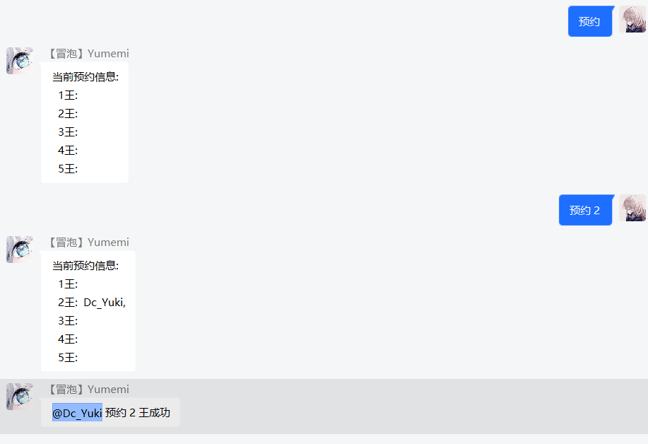

### 模块列表 <!-- {docsify-ignore} -->

>`yumemi`主要以 [公主连结☆Re:Dive](https://priconne-redive.jp/) 玩家为核心，预计开发模块有：

- ~**摸轴录入**~ (BigFun官方工具上线，移除)
- ~**作业查询**~ (作业网 aip key 已被回收，暂不可用)
- ~**web 后台**~ ~(BigFun官方工具上线，移除)~ (因群友要求，项目基于 vue 重构中...)
- **会战管理**
- **买药助手**
- **rank 搬运**
- **每日一言**
- ~**日程推送**~
- ~**排名提醒**~

### 娱乐功能 <!-- {docsify-ignore} -->

- ~**头像竞猜**~(在做了在做了)
- ~**图灵聊天**~(人工智障，已移除)
- **趣味十连**
- **随机涩图**
- **头衔申请**

### 其它功能 <!-- {docsify-ignore} -->

- ~**新番列表**~
- ~**图片查询**~

!> 由于`yumemi`更新进度缓慢，某些功能未能在上面列出，但会在日后补上，下面具体介绍

> 由于当前页面内容较多，还请善用侧边栏的搜索功能

### 趣味十连

- 举个栗子
  + 扭蛋池抽取分为普通池和付费池，`来发十连`、`抽个十连`等均可触发，默认抽取白金卡池
- 正则公式
  + `^[来抽][发个次]十连$`
  + `^[来抽][发个次](付费十连|傻子必得|傻必)$`
  + `^(查看|当前|当期|本期)(卡池|up|扭蛋|扭蛋池)$`
- 补充说明
  + 输入`来发傻必`抽取付费十连，计划日后添加每日签到功能赠送付费石，可随意分配抽取
  + 支持卡池切换，输入`切换卡池xx`可自由切换`bl`、`tw`、`jp`卡池
- 问答环节
  + 为什么没有做抽一井的功能？
  + 个人认为做出来会大大减少抽卡的趣味性，模拟抽卡本身就是为了趣味性和爽，你看那傻子必得他不香么（  

### 随机涩图

- 举个栗子
  + 涩图分为随机涩图与指定涩图，`来份色图`、`来张涩图`等均可触发
- 正则公式
  + `^来[点张份][\S]*[涩瑟色]图$`
- 补充说明
  + 图片来源p站，支持 tag 搜索，例如`来点可可萝色图` ~~（我报警了）~~ ，`来点`与`色图`之间为关键字
  + 本功能的初衷是为了活跃群内氛围以及增加趣味性而制作，请某些`lsp`和`未成年人`节制使用
  + 发送的图片请务必遵守所在国家及其地区的`法律法规`，因使用不当所造成的后果本人概不负责

### 头衔申请

- 举个栗子
  + 此功能触发比较简单，`申请头衔 + xxx`即可触发，例如`申请头衔 咕咕咕` ~~（其它功能在做了在做了）~~
- 正则公式
  + `^申请头衔[\s]?[\S]+$`
- 补充说明
  + 本功能需要bot有群主权限  

### 买药助手

- 举个栗子
  + ~~哈？这么简单的功能直接看下源码不就知道怎么用了么，还需要说明？~~
- 补充说明
  + 在每天的`0`、`6`、`12`、`18`点整发送买药提示
  + 如要自定义可查看`modules/buy/index.js`，稍作修改即可实现时钟功能

### 每日一言

- 举个栗子
  + 在每天的`0`点整发送随机一言
- 补充说明
  ~~生不出人我很抱歉~~

### rank 搬运

- 举个栗子
  + `台rank`、`国服rank`均可触发
- 正则公式
  + `^(b|bl|国|台|日)服?rank$`
- 补充说明
  + 表格仅供参考，升r有风险，强化需谨慎
- 数据来源
  + 国服：[席巴鸽](https://space.bilibili.com/14454663)
  + 台服：[無羽nonplume](https://forum.gamer.com.tw/A.php?bsn=30861)
  + 日服：待补充

### 会战管理

!> 这里是正在施工的 **会战管理** 文档，不定时更新

#### 发起会战

- 在使用会战功能前，若你从未修改过公会信息，则需要先设置当前游戏服务器
- 举个栗子
  + `设置国服公会`，默认参数为 `none` ，可选 `bl`、`tw`、`jp`
- 正则公式
  + `^设置(国|台|日)服公会$`

- 在一切准备就绪后你就可以开启当期会战
- 举个栗子
  + 发送`开启xx座会战`可初始化公会战数据，`xx` 为当期会战星座
- 正则公式
  + `^开启[\S][\S]座会战$`
- 补充说明
  + 发送指令后会自动记录当月时间，无需手动关闭，下期会战到来之际发起的会战请求即可 ~~不要问我名字打错了怎么改，我没做这功能~~

#### 伤害记录

- 举个栗子
  + 发送`报刀 + xxxx`即可记录出刀数据
- 正则公式
  + `^报刀[\s]?[0-9]+$`
  + `^尾刀$`
- 补充说明
  + 若斩杀 boss ，则需要输入`尾刀`指令而不是`报刀`，不必传递其它参数

#### 数据修正

- 举个栗子
  + 发送`出刀信息`可查看你 **当天** 所有的出刀数据 ~~报个刀都会报错，真丢人，退群吧你~~
  + 格式为`修改 1 1200000`，`1`代表当天出的第一刀，`1200000`则是修正后的数据
  + **此处** 的参数与参数之间 **必须** 使用空格分隔
- 正则公式
  + `^修改[\s][0-3].?[0-9]?[\s][0-9]+$`
- 补充说明
  + 目前发送的出刀数据为数据库原 String ，观感较差，后续会改的 ~~再改了再改了~~
  + 修改 boss HP值指令为`血量 xxxxx`

!> 业务逻辑近期重构，数据修改暂不可用...可查询当天出刀信息

#### 预约提醒

- 举个栗子
  + 发送`预约`可查看当前预约信息
  + 若需要预约 boss ，输入`预约 x`将会在 boss 变更时收到 At 提示，`x`参数为`1 ~ 5`
- 正则公式
  + `^预约[\s]?[1-5]?$`

#### 挂树报时

- 举个栗子
  + ~会长我 xcw 暴击啦~ 发送`挂树`或`sl`会记录当前时间，并定时提醒以防掉刀
- 正则公式
  + `^(挂树|sl)$`

!> 数据库近期重构，挂树以及修改数据暂不可用...

### 日程推送

- 举个栗子
  + 咕咕咕...
- 补充说明
  + ~~我想做一个爬虫~~
  + ~~你要先有经验~~
  + ~~所以我需要开发来获取~~
  + ~~辣李就去开发啊！~~
  + ~~我他喵的没经验怎么开发！~~
  + ~~**做 爬 虫！**~~

### web 后台

- 举个栗子
  + 发送`登录`、`login`或直接访问 [小枫叶](http://www.littlemaple.club) 即可
- 正则公式
  + `^(登录|login)$`
- 补充说明
  + 咕咕咕...

!> 其它待补充，如有遗漏可以私信我也可以在群内 `at` 我