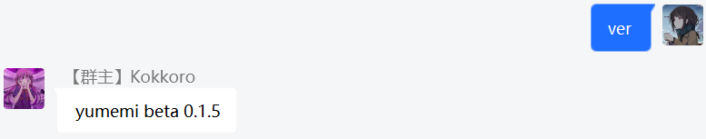

### 项目安装

本项目不用安装任何第三方软件依赖，非常简单轻便，仅需三行命令即可运行

> 首先 clone 项目仓库（在此之前你需要安装并掌握 [nodejs](https://nodejs.org) 的相关知识）

```
git clone https://gitee.com/Dc_Yuki/YumemiBot.git
```

> 使用 npm 安装 node 模块

```
npm install
```

### 目录结构

> 修改`config_example`目录名称为`config`，并正确配置添加`command.yml`、`setting.yml`、`serve.yml`所对应的参数

```
YumemiBot
├─ yumemi                   bot 目录
│  ├─ config                配置信息
│  │  ├─ command.yml        正则匹配
│  │  ├─ serve.yml          插件设置
│  │  └─ setting.yml        基本参数（QQ 号，群号）
│  ├─ data                  资源目录
│  ├─ modules               插件目录（存放编写好的插件）
│  ├─ message.js            消息处理
│  └─ tool.js               自定义工具类函数
└─ app.js                   程序主入口（用于登录 QQ）
```

### 启动程序

> さあ、ゲームを始めよ

```
node app.js
```

如上述步骤无误，在群内发送`ver`即可收到以下回复

