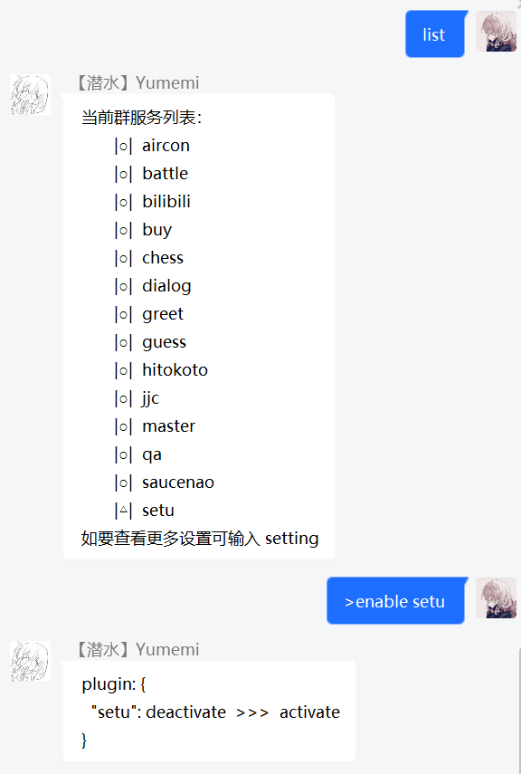

### 项目安装

本项目不用安装任何第三方软件，非常简单轻便，仅需三行命令即可运行

> 首先 clone 项目仓库（在此之前你需要安装并掌握 [nodejs](https://nodejs.org) 的相关知识）

```
git clone https://github.com/dcyuki/YumemiBot.git
```

> 使用 npm 安装 node 依赖模块

```
npm install
```

### 目录结构

> 修改`data/db/yumemi.db.example`数据库文件为`yumemi.db`  
> 修改`config_example`目录名称为`config`，并正确添加`botSetting.yml`文件所对应的参数

botSetting.yml 配置参数
```yaml
# bot 账号
account:
  qq: your qq number
  password: your qq password or password md5
# bot 主人
master: your master qq
# bot 群聊
group:
  # 可填写多个群号，true 为监听该群
  your group number: true
  your group number: false
```

- **什么是 YAML**
  + YAML 是一种专攻配置的语言，可读性高（JSON 有时确实让人眼花缭乱不是么？）
  + 本项目所有的配置文件均使用 YAML 编写，你也可以查看 [YAML 入门教程](https://www.runoob.com/w3cnote/yaml-intro.html) 获取相关信息

项目文件结构
```
YumemiBot
├─ yumemi                     bot 目录
│  ├─ config                  配置信息
│  │  ├─ boss.yml             会战信息
│  │  ├─ botSetting.yml       基本参数（QQ 号、群号等信息）
│  │  ├─ command.yml          正则匹配
│  │  └─ pluginParam.yml      插件参数（模块多参数配置文件）
│  ├─ data                    资源目录
│  │  ├─ db                   数据库文件
│  │  └─ images               图片资源
│  ├─ plugins                 插件目录（存放编写好的插件）
│  ├─ message.js              消息监听处理函数
│  ├─ plugins.js              模块自动加载函数
│  └─ tool.js                 自定义工具类函数
└─ app.js                     程序主入口（用于登录 QQ）
```

> 如上述步骤无误  
> bot 启动成功后会在`config`目录下自动生成`pluginSetting.yml`文件  
> 当然，如果你有`js`的相关知识，随时都可以编写自己的插件，详情可在 [插件开发](develop/) 一栏查看

### 启动程序

```
npm start
```

!> 在群内发送`ver`即可收到以下回复，所有模块 **默认关闭** ，可发送`list`查看服务列表自行启用  


- 开启模块
  + `开启 | 关闭` + `模块名`
- 正则公式
  + `^(开启|启用|打开|关闭|禁用)[\s]?[a-zA-Z]+$`

